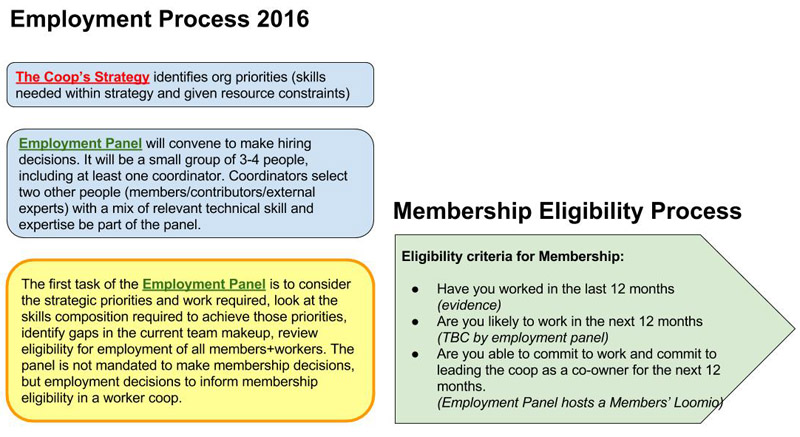

# Employment

Principles to guide employment

Employment panel decisions should:

    be driven by strategic priorities (not 90-day planning)
    build thriving team with continuity & consistency
    be made by a clear & transparent process
    be decided within a clear timeframe
    be informed by budget (agreed by membership)
    consider membership potential (broader skills, values alignment, self-management)
    usually progress from short contracts to long / employment
    cover both short projects and long-term hires

What are the next steps?

The first task of the employment panel is to consider the strategic priorities and work required (post-planning), look at the skills composition needed to undertake that work, identify gaps in the current team makeup, and review eligibility for employment of all members and workers. They’ll be taking account of lots of different things, including skills match, current contracts, availability, experience, membership.
Membership process

The employment panel does not make membership eligibility decisions, but employment eligibility decisions do inform membership eligibility decisions. The structure working group is making a recommendation that clarifies the implementation of our current membership eligibility process, which comes down to meeting three criteria:

    Has the person worked in the last 12 months (evidence)
    Are they likely to work in the next 12 months (TBC by employment panel)
    Are they able to commit to work and commit to leading the coop as a co-owner for the next 12 months (Employment Panel hosts a Members’ Loomio)

The structure working group recommends that we keep the formal process defined in the Constitution, in which the Board determines membership eligibility when approving the recommendations for membership that come from members. 

As we have put our new Employment process into practice, we've found a need to clarify one aspect. After a meeting between the SSWG and the coordinators, we are putting forward the following recommendation.

We clarify that there are two types of employment at Loomio:

    Ongoing roles - long term, potentially puts the person on the membership pathway, person participates in the sprint process and has a member-steward (examples: Babs, Nati, all worker-members)

    Project-based contracts - short term, limited in scope, person is not on the membership pathway, doesn't necessarily join the sprint process, reports to the coordinators as their steward (examples: Ants, Yasmine, the bookkeeper)

Recommendation

Coordinators should have the mandate to make project-based hiring decisions without a full employment panel, while ongoing role contract hires are made by an employment panel (i.e. coordinator(s) plus other members), as we agreed.

Reasoning

Putting someone on the pathway to membership is a consequential thing for us as a co-op, and it's worth taking a little more time and getting some more brains/eyes on the decision (although it's only when the actual membership invitation decision is being make on the other end of the pathway that all members will be involved).

But if someone is not going onto the membership pathway because their role is limited in scope/time, it makes more sense to let the coordinators move quickly and there isn't necessarily a need for a full employment panel to be convened. Coordinators have their heads around the budget and skill mix of the team, and are best placed to make decisions about contractors to fill specific needs.

Notes

    It's important that the coordinators are very clear on when someone is transitioning from type 2 to type 1 - if we start someone on a short term project basis, but then want to keep employing them longer term, and employment panel needs to be convened. The guideline is 3 months - if someone is working with us longer than that, we expect the coordinators to review their status and proceed accordingly.

    In practice, the coordinators have sometimes been convening employment panels (or something close to it) even for short term roles (such as Ants). That's totally fine - if coordinators feel they want more people involved in the decision that's up to them. The point is that unless someone's stepping onto the membership pathway, they aren't required to have a panel. Of course coordinators will work closely with the people involved in a potential contractors work to make a decision (in practice it will often be a working group hiring someone and just getting clearance from the coordinator, like the Growth team with Ants).

    So for example, if the US Sales assistant MJ wants to engage is coming on with a short term contract (up to 3 months) and limited scope, then she can work directly with coordinators and just make the call. If it's going to be a long term arrangement putting the person on the membership pathway, or the agreement transitions to that after a short term contract, then an employment panel would be convened.

