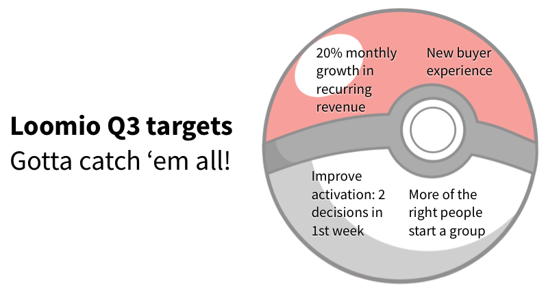

# Planning

### Annual 
we do annual planning so everyone is focussed on the same thing

For 2016, our annual planning process started with a day out of the office. Together we agreed what our focus would be for the year: the one thing that everyone is contributing to, regardless of their job.

We’ve always said that the best way we can deliver our social mission is to develop the financial freedom to chart our own course. So at our planning day we agreed that our focus for 2016 is on proving the business model.

We discussed how we can break this work up into streams, based on the groups of people we serve:

* we want to earn the confidence of values-aligned investors who will support our growth
* we want to reach out into the world to tell people about how we can help them organise inclusively and effectively
* we want to support our customers to use Loomio to make a positive impact in their workplaces and communities
* and we want to nurture our team of amazing humans to feel awesome in their work

We also set some specific targets to measure our progress, and named some of the big chunks of work we knew we’d have to do to get there. After the planning day, the coordinators facilitated a process to bring all this together into a budget and visual plan-on-a-page:

### Quarterly

Every quarter, we have an away day, (preceded and followed by various preparation and workshops), where we take stock of where we are relative to our overall vision, annual plan, and emerging reality, and decide what to focus on for the coming 3 months.

Quarterly plans take a range of forms, depending on the circumstances and needs of the team. The goal is to providing a guiding focus for all our work. Because we give individuals a lot of autonomy in their daily work and don't micro-manage, we need to agree some themes and shared goals to have collective impact. If we try to do everything we're likely to be distracted and stretched too thin. And we like to name ambitious goals to motivate ourselves.

**Quarterly planning generally follows this overall format.**

Last week of previous quarter

* working groups each convene and discuss what they accomplished in the quarter about to end, and what they've learned to inform what we could work on next
* evidence and metrics are produced
* the coordinators write a quarterly report giving an assessment of how we did achieving our previous quarterly goals

Away Day (Offsite)

* 
