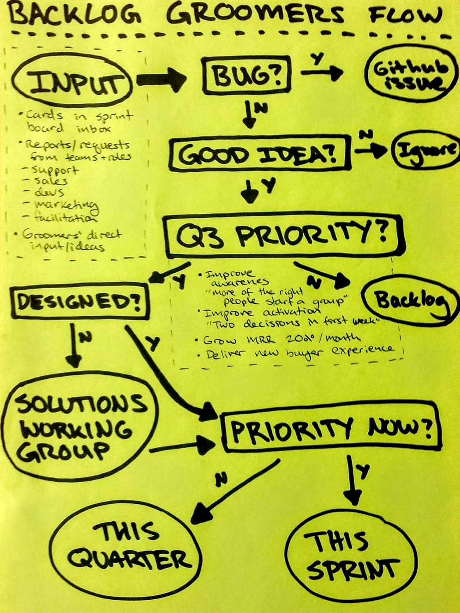

# Product Prioritisation
Groomers and product owner

[How the Loomio team decides what to work on next](https://docs.google.com/document/d/1ChXUsITlMEKwVEwdZV0rzti1ON0KxejT500ERHJPrTc/edit)

[What's the role of the Product Owner now we have Groomers?](https://www.loomio.org/d/uo9hKLfF/what-s-the-role-of-the-product-owner-now-we-have-groomers-)

[Product owner role](https://www.loomio.org/d/ZLK7O3Ii/i-m-pondering-making-myself-available-to-be-product-owner)

We get together fortnightly to consider what’s the most strategic use of our design and development capacity over the next couple of sprints.
Team reps

We start by hearing from reps from across the business (Support, Marketing, Sales, Product): what are your upcoming priorities we should consider for the next couple of sprints?

So for instance, Nati representing the Support team, comes every sprint with a summary of support requests (based on the feedback spreadsheet). The Groomers check that we are addressing the trending support requests.
Inbox

Next we look at the Inbox. Anyone from the team can put a card on the Inbox for the Groomers to evaluate, based on the flowchart (below).

If it's a good idea that fits with our priorities, it will either go to the Solutions Working Group if it needs design, or it will go onto the This Quarter or Next Sprint column. Otherwise it gets put on the Not This Quarter backlog, or it gets merged into an existing card, or deleted.

At the end of each session the Inbox is empty, and the Groomers report out to the rest of the team.
Writing good stories

Anyone from the team can add a story to the Inbox (the first list on the Loomio Sprint Board).

A story is either a description of a problem, or a statement of value. At the very least a story should have a name, and 3 lines: “As a... I want to... So that I can...”.

Some other things you can include to make it a stronger contender:

    Evidence: “7 customers have asked about X this year”
    Effort to deliver: “This is a huge job”
    Value: “If we had this feature we’d make X sales”
    Risk: “If we don’t do it, we will be in big trouble”
    Opportunity cost: “Working on this means we won’t be working on this”

