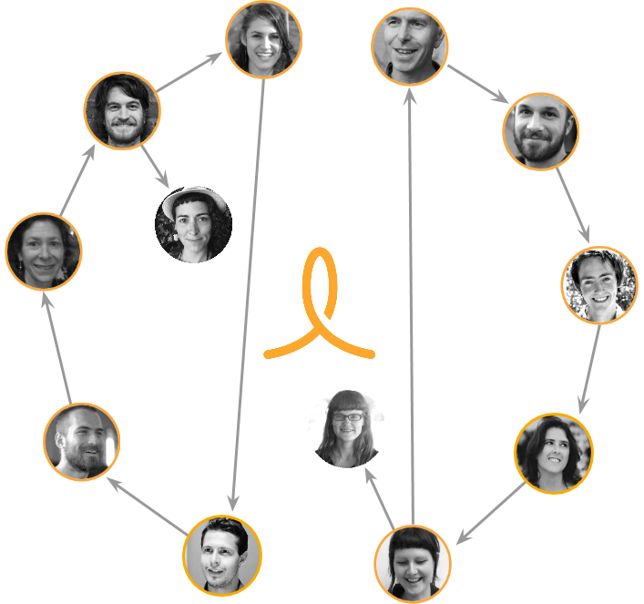

# Stewarding

We don't have bosses, so we figure out how to serve the useful functions bosses can serve in other ways. Some of that is covered by [Coordinators](https://loomio.gitbooks.io/loomio-cooperative-handbook/content/coordination.html) or other processes. Stewarding is Loomio's approach to peer support.

Here are some of the things a boss might do in another organisation, that stewards hold at Loomio:

* be the ones you talk to if your coworker is being a jerk
* support you to meet your personal development goals
* help make sure you do the things you said you were going to do
* put a human face on talking to 'the organisation'

When you have an issue, you can’t approach a group; you need a specific person you know you can turn to. This is what your steward is for. They won’t solve every problem, but they are your point of contact to make sure the problem gets solved. If you don't know who to go to, you can always go to them.

Stewarding is not about managing your daily work. Its about you as an individual, and your relationship to the co-op. They can be your mentor, or your guide, or your sounding board. If you ever get into a conflict situation, they’ll be by your side making sure you are well supported to a resolution.

Everyone working on Loomio should have a steward (if you don’t, talk to Rich!). Usually, all the members of the co-op are stewarding someone, which means there are lots of connections across the co-op and lots of opportunities for exchanging insights.

Most people meet with their stewards about once per month; you’ll probably find a rhythm that works for you. Your steward might ask you questions like:

* how was last month? what did you like or dislike?
* what do you want to do differently this month?
* what longer term goals are you working on? how are you progressing on them since last time?
* how can I best support you?

We’ll raise a proposal on Loomio once per month, as a reminder for stewards to check in with their stewardees.
